# Space Engineers VR controls
Read Common Controls once, then find your state.

- [Common Controls](#start)
- [On Foot & Tools](#foot)
- [Jetpack](#jetpack)
- [Flight & Driving](#cockpit)
- [Cockpit Interaction](#cockpit-controls)
- [Building](#building)
- [3rd Person](#view)
- [Floating Menus](#menus)
- [Other](#other)

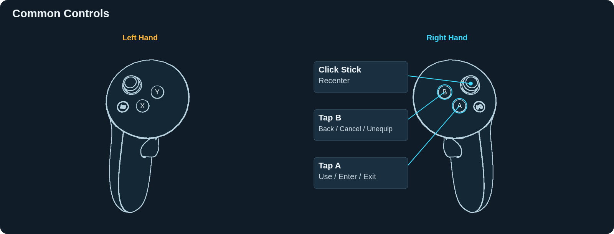

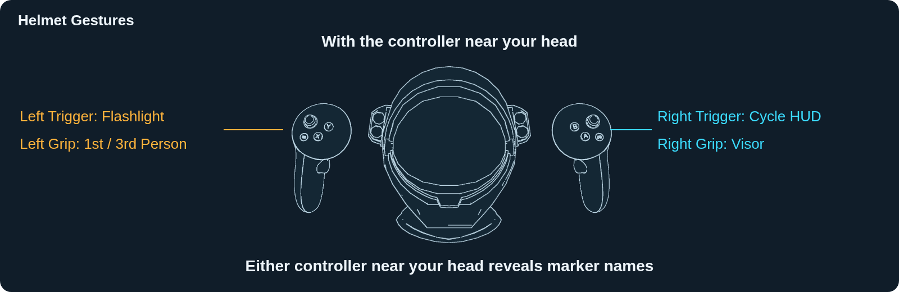

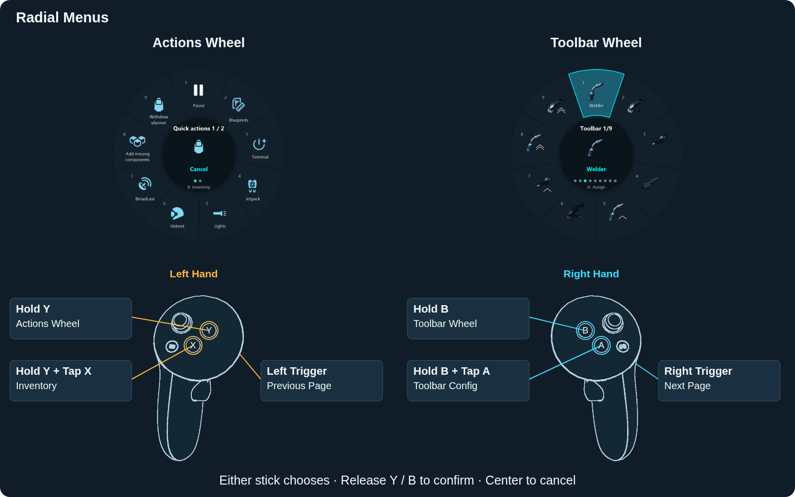

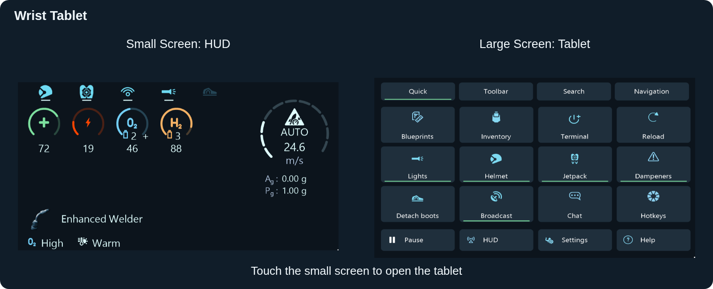

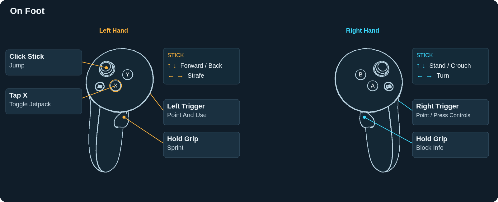

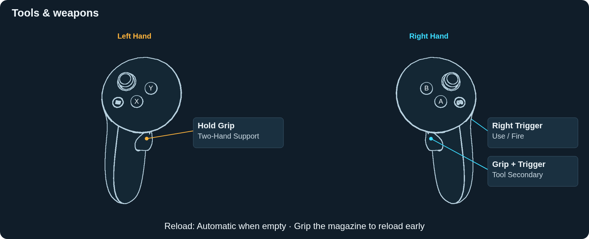

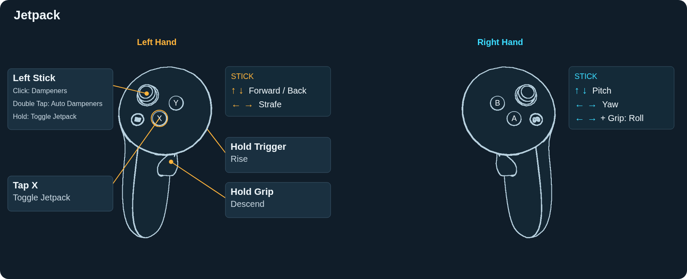

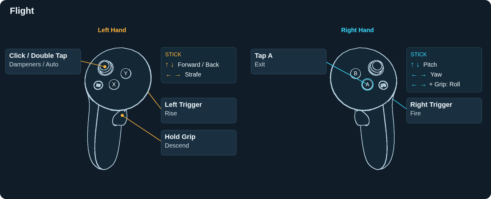

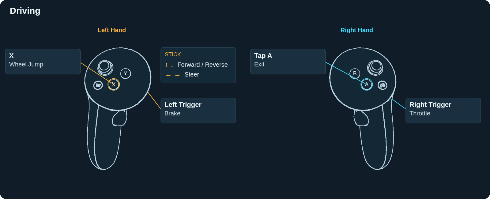

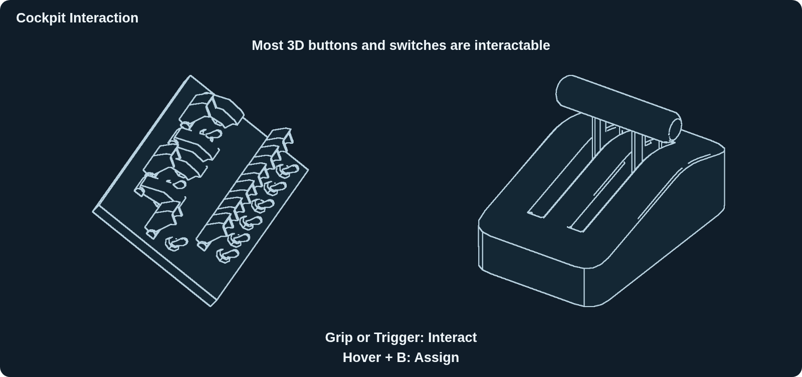

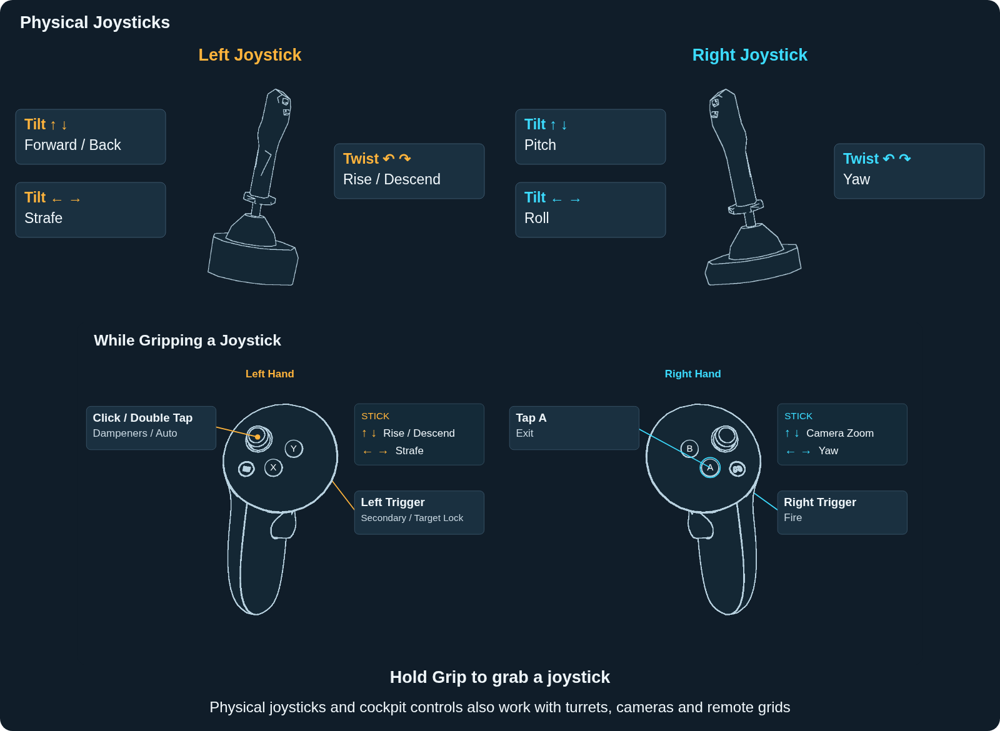

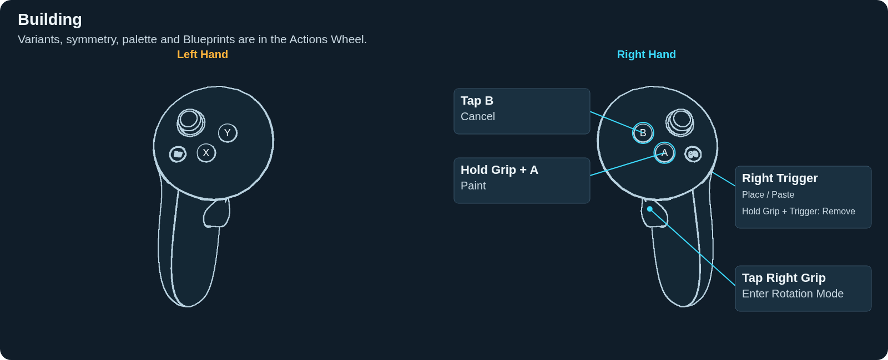

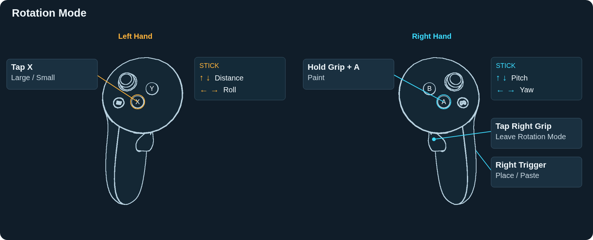

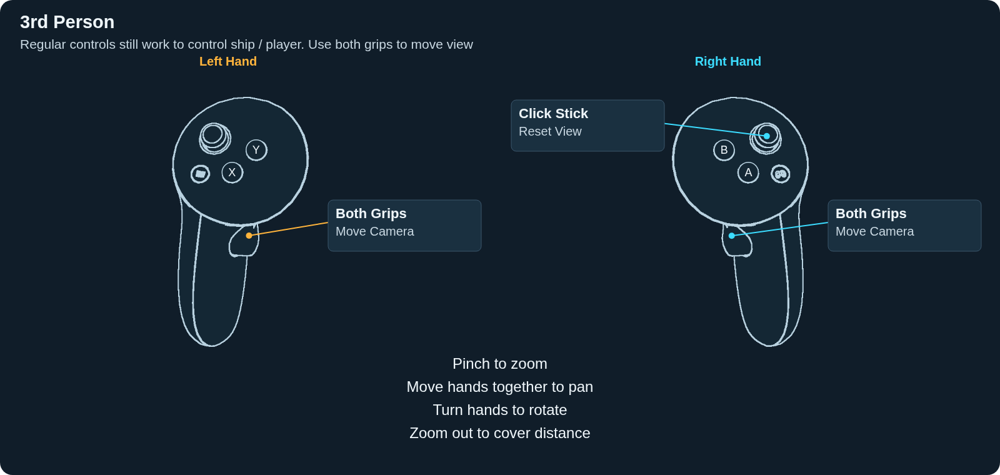

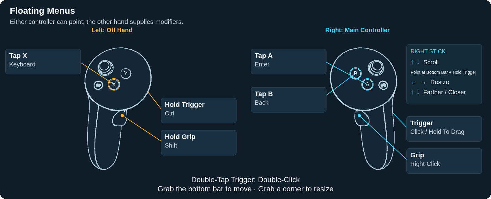

## Other

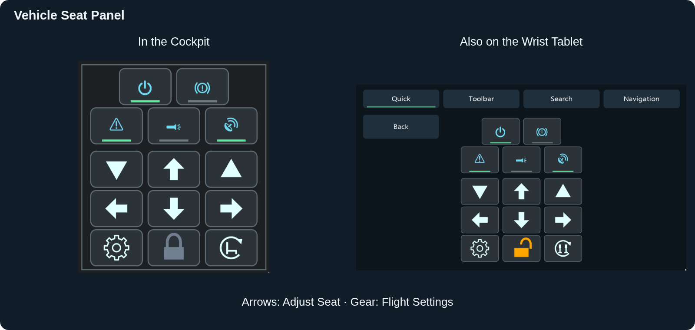

- **Search:** Use the tablet’s Search tab to find actions, settings and other controls.
- **Hotkeys:** Open Hotkeys on the tablet. Tap ALT, then F10 for Alt+F10; modifiers stay selected until used.
- **Turrets, Cameras & Remote Grids:** Regular controls work while operating turrets, cameras and remote grids. Cockpit physical controls remain available.
- **Custom Vehicles:** Twist the right wrist for throttle. Enable Flight / Motion in vehicle settings.
- **Spectator:** Use the same 3rd Person camera controls. The Actions Wheel has extra camera and follow actions.
- **Desktop Mirror:** Search Desktop floating or Desktop wrist to view your monitor in VR.

Nearly everything in the game should be accessible through VR controls, menus or Hotkeys. Feel free to open a Github issue if you find something that is not.

Controller art: [WebXR Input Profiles](https://github.com/immersive-web/webxr-input-profiles/tree/main/packages/assets/profiles/meta-quest-touch-plus), [MIT license](SpaceEngineersVR/Assets/Guide/NOTICE.txt).
